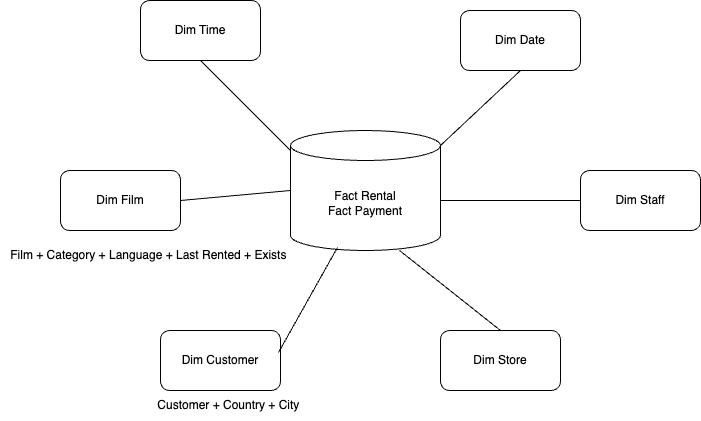

### Sakila Data Warehouse

This project builds Star-schema shaped data 
for my first data warehouse
1. Original data is based on transactions and entities of video rental store chain, like BlockBuster (F) 
2. Source of the data https://github.com/jOOQ/sakila
2. DW Architecture

### devnotes
- dbt seed = load fixtures (from CVS, or kind of files)
- dbt run
- dbt test
- dbt build = wrapper for combination of seed + run + test

YAML files

1. /home/user/profiles.yml - target schema for data transformation via DBT
2. /project/dbt_project.yml
- paths (models, files) so dbt can search
- redefine schema
3. /project/models/schema.yml

dbt run //all the models
dbt run -m example // the whole dir
dbt run -m dimensions.dim_date

dbt test // tests the result (rel), not the source (stg), do dbt run first to materialize the data

macros // override default dbt behavior globally

https://hub.getdbt.com/
dbt deps // install packages listed in packages.yml

hoooks // hook runs before/after dbt module run